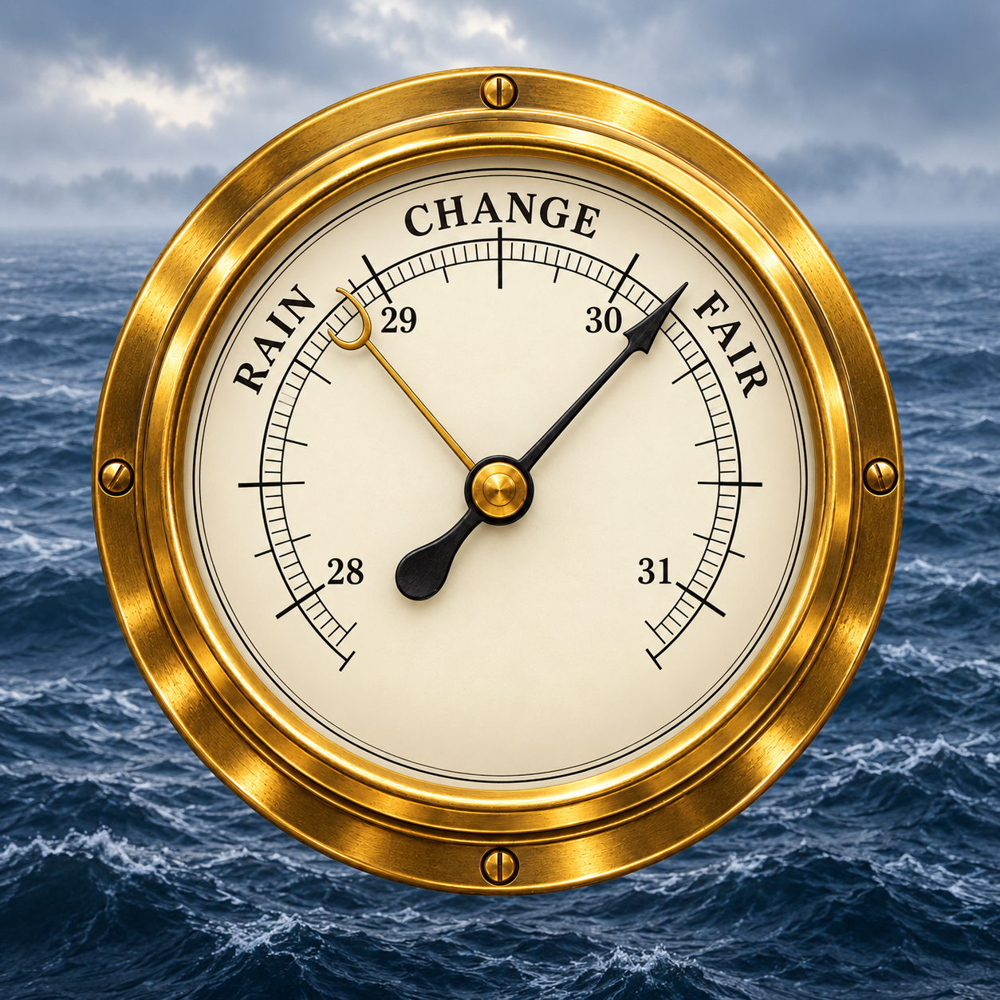

<!-- Independent modifications by SCarns, 2026. Derived from oyve/signalk-barometer-trend v2.3.4; see NOTICE. -->
# Ship's Barometer



**Offline weather interpretation from the boat's own sensors.** Ship's Barometer combines traditional barometric forecasts with an optional assessment of measured pressure changes, wind strengthening/easing, moisture conditions and water-temperature context.

This is an independent continuation of [signalk-barometer-trend v2.3.4](https://github.com/oyve/signalk-barometer-trend/tree/v2.3.4), created by **[oyve](https://github.com/oyve)**. The underlying [barometer-trend](https://github.com/oyve/barometer-trend) library is also by oyve. Their work supplies the original pressure analysis and forecast models; this project adds integration corrections, local observations, quality checks and independent packaging. It is maintained by [SCarns](https://github.com/SCarns) and is not endorsed by the original author.

## What it does

- Converts Signal K true-wind direction from radians to the degrees required by the forecasting library, including a one-time conversion of legacy saved history.
- Retains all 21 pressure/forecast paths used by the original 2.3.4 plugin and existing dashboards.
- Optionally publishes `environment.outside.weather.assessment`: measured changes, short reasons, SI units, source IDs, original timestamps, missing inputs and quality flags.
- Uses local humidity/temperature or a supplied Derived Data dew point, with checks for disagreement and observation-time mismatch.
- Compares air and dew point with local water temperature while explicitly distinguishing transducer-depth water from a measured surface temperature.
- Preserves separate pressure and assessment history across restarts. Runs without any weather API or internet connection after installation.

The assessment is **descriptive and experimental**. It does not provide a calibrated rain probability, future wind speed, confirmed fog, gust forecast or new automatic alarm. Heat index and wind chill remain with Derived Data. The optional assessment is off by default.

## Install

Available on [npm](https://www.npmjs.com/package/signalk-ships-barometer). Refresh the Signal K store and search for **Ship's Barometer**, or install from your Signal K user directory:

```sh
cd ~/.signalk
npm install --save signalk-ships-barometer
```

Download `signalk-ships-barometer-0.1.0.tgz` from [GitHub Releases](https://github.com/SCarns/signalk-ships-barometer/releases/latest) and copy it into your Signal K user directory, normally `~/.signalk`:

```sh
cd ~/.signalk
npm install --save ./signalk-ships-barometer-0.1.0.tgz
```

**Disable Barometer Trend before enabling Ship's Barometer.** The plugins share the original forecast output paths; running both would create competing publishers. You can keep the old package installed for rollback.

Restart Signal K and enable **Ship's Barometer** in plugin settings. To use the extra assessment, enable **Local weather assessment**. Check [installation and migration](docs/installation.md) for source/depth settings and history handling.

Version 0.1.0 is published on npm under **scarns**, with the Signal K discovery keyword and app icon metadata. Store indexing/cache refresh may take time. See [publishing to the Signal K store](docs/publishing.md) for future releases.

## Local inputs and output

| Input | Signal K path | Units |
|---|---|---|
| Pressure | `environment.outside.pressure` | Pa |
| Air temperature | `environment.outside.temperature` | K |
| True wind direction | `environment.wind.directionTrue` | rad |
| True wind speed | `environment.wind.speedTrue` | m/s |
| Humidity | `environment.outside.humidity` or `environment.outside.relativeHumidity` | ratio |
| Optional supplied dew point | `environment.outside.dewPointTemperature` | K |
| Optional water temperature | `environment.water.temperature` | K |

Set the assessment source IDs explicitly when multiple local sources share a path. Blank source fields retain the first valid local source. Sources identified as Open-Meteo, NOAA or WeatherAPI are excluded from the assessment. Only this vessel's timestamped observations are accepted. The source IDs and timestamps used remain visible in the assessment.

The new assessment contains `pressureState`, `windState`, `moistureState`, `waterContext`, `fogContext`, `qualityFlags`, `measurements`, `units`, `inputs`, `missing` and `reasons`. `windOutlook` is explicitly `uncalibrated`.

## Evidence and development

The first release comes from a local archive study and installation testing. The wind-angle fix corrects a unit-contract error; it does **not** establish improved rain accuracy. The pressure-to-future-wind association was inconsistent across periods and decision-window timings, so the new assessment reports observed changes rather than an automatic wind warning. Water context has software tests, but no boat-fog accuracy score.

The release is based on the working **2.3.4** lineage. Upstream's newer main branch uses a different library interface and path layout; this project intentionally retains the installed 2.3.4 output contract. See [validation and limits](docs/validation.md).

Requires Node.js 18 or newer. For development:

```sh
npm ci
npm test
```

Runtime dependencies are bundled in the release tarball; development dependencies are not. Contributions should include meaningful tests and retain the distinction between measured conditions, hypotheses and verified forecast outcomes.

## License and credits

[Apache License 2.0](LICENSE). Original license text is retained; modified-file attribution and additions are recorded in [NOTICE](NOTICE) and [CHANGELOG.md](CHANGELOG.md). Runtime dependencies retain their own license notices. The nautical artwork was generated with OpenAI image generation at SCarns' direction.
